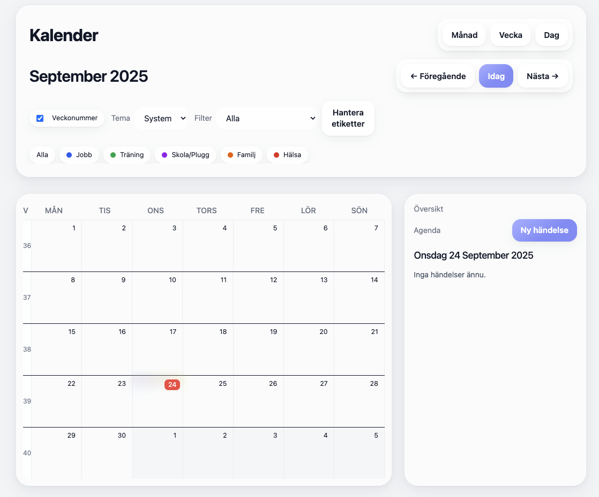

# ✨ Premium Kalender App

En modern kalender byggd med **React + Vite + Tailwind CSS**.
En kalender med månad-, vecka- och dagvyer, där man enkelt kan skapa, flytta och justera händelser.

---

## Funktioner

**Vy-lägen:** Månad, Vecka, Dag, Agenda
**Interaktion:** Klick & dra för att skapa händelser, drag & drop + resize av block
**Etiketter:** Färgkodade kategorier (jobb, träning, plugg osv), hantera egna etiketter i modal
**Design:** Glassig, pastellig, responsiv layout, optimerad för både desktop och mobil
**Mobilvänlig:** Horisontell scroll på chips/filter, kompakta dagceller, modaler anpassade för små skärmar
**Persistens:** Händelser och etiketter sparas i localStorage
**Filter:** Visa alla eller filtrera på specifika etiketter
**Highlight:** Idag-markering + "Hoppa till idag"-knapp

---

## Teknikstack

- **React 18**
- **Vite**
- **Tailwind CSS**
- **date-fns** för datumlogik
- **localStorage** för lagring

---

## Licens & attribution

Byggd av **@JuliaRymem**

